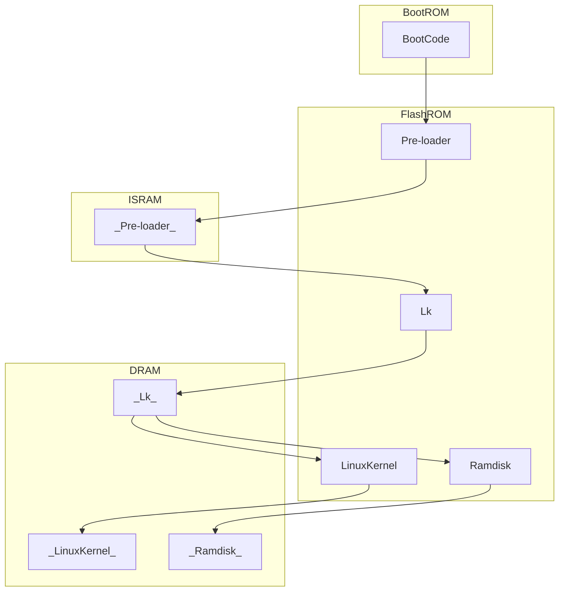

This note is my take and how I have understood that Linux boots on embedded devices. I am referring to a blog post on LinkedIn which I have mentioned in the credits.

---

# Boot ROM (BROM) and Startup

When an ARM CPU is powered on, the program counter points to the beginning of a ROM which is embedded in the IC. This is called the Boot ROM or BROM.

There exists a small program in the BROM called the boot program which loads the *preloader* into the ISRAM (Internal Synchronous RAM)

Me when the pre-loader needs to be loaded.

This preloader can be considered to be a **primary bootloader**, as it actually boots the U-Boot into the DDR.

## What the preloader actually does
1. Hardware initialisation: This includes but is not limited to:
	1. Resetting the peripherals.
	2. Setting the Microprocessor to secure mode.
	3. Initialise the memory controller.
	4. Initialise the serial port.
2. Then the preloader may choose to move itself to the main memory (which will be referred to as DRAM or DDR in this note). It also makes sure that a *stack is set up in the main memory* which is required by the U-Boot bootloader (as it is written in C).
3. It then locates the **secondary bootloader** (which will be reffered to as the little kernel, this is also the part which is called U-Boot in our project) in the flash memory (NAND / EMMC) and loads it into the main memory. 
4. Its initialises the stack for the execution of the U-Boot program.

# Secondary Bootloader
After the preloader initialises the DRAM, it then loads second stage code of the Bootloader into the RAM space.

Two points must be determined when copying:
1. Starting and ending address of the executable image of second stage in the ROM
2. Starting address of the RAM space.

## Workflow of the second stage of the bootloader
+ Initialise the hardware to be used in this state.
+ Check the system memory map.
+ Load kernel image and root file system image.
+ Set kernel startup parameters.
+ Boot kernel.

# Credits
+ Praveen Singh. "How U-boot loads Linux Kernel?" May 13th, 2021. [URL](https://www.linkedin.com/pulse/how-u-boot-loads-linux-kernel-praveen-singh/)
